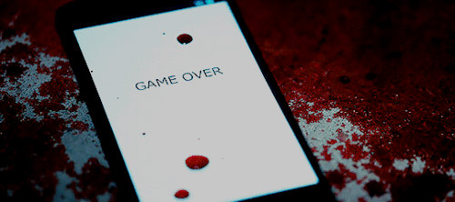

## **Me**  

 Hey! Welcome to my github. Yes there is everything, and a bit of anything! but hey ... In short, my codes will perhaps be useful to you in several situations. Don't forget to like :)

 Привет! Добро пожаловать на мой гитхаб. Да есть все и всего понемногу! но эй ... Короче, мои коды, возможно, будут вам полезны в нескольких ситуациях. Не забывай любить :)
 

<h3> <u>A Few Quick Facts</u></h3>
<ul>
<li>🔭 I’m currently working on <b>Blanche Neige</b>, <b>Live-Hack</b>  and <b>Cassys</b></li>
<li>👾 <b>Not dead</b> = Player</li>
<li>👾 Dead = Game Over</li>
<li>👨‍💻 My projects are available on <a href="https://github.com/Sn0wAlice">Github</a></li>
</ul>

| Websites Name | Website URL |
| -------------- | :---------: |
| Cyber Dream | cyberdream.space |
| Blanche Neige | blanche-neige.org |
| Live Hack | live-hack.org |
| Cnil & me | cnil.me |

[General chat :p](https://github.com/Sn0wAlice/Sn0wAlice/discussions)

 
 

## My soft

